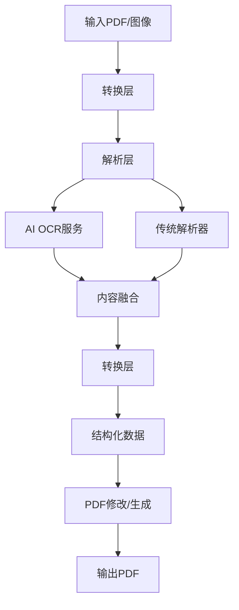

# 设计：PDF处理项目

## 架构概览

### 项目结构
```
pdf-processor/
├── src/
│   ├── converters/
│   │   ├── pdf-to-image.ts
│   │   ├── image-to-pdf.ts
│   │   └── index.ts
│   ├── parsers/
│   │   ├── traditional-parser.ts
│   │   ├── ai-ocr-parser.ts
│   │   └── index.ts
│   ├── transformers/
│   │   ├── structured-data-extractor.ts
│   │   ├── pdf-modifier.ts
│   │   └── index.ts
│   ├── types/
│   │   ├── pdf.ts
│   │   ├── conversion.ts
│   │   └── index.ts
│   ├── utils/
│   │   ├── file-handler.ts
│   │   ├── validation.ts
│   │   └── index.ts
│   └── index.ts
├── tests/
├── examples/
├── docs/
└── package.json
```

### 核心组件

#### 1. 转换层
- **PDF转图像**: 使用`pdf2pic`进行高质量渲染
- **图像转PDF**: 使用`pdf-lib`从图像创建PDF
- 支持多种图像格式（PNG、JPEG、WebP）

#### 2. 解析层
- **传统解析器**: 使用`pdf-parse`提取文本和元数据
- **AI OCR解析器**: 使用可配置的AI API接口进行智能内容识别，支持多种OCR模型
- 回退机制：当传统解析不足时使用AI OCR

#### 3. 转换层
- **结构化数据提取**: 将解析的内容转换为JSON/YAML/CSV
- **PDF修改器**: 使用`pdf-lib`编辑现有PDF
- **基于模板的生成**: 从结构化数据模板创建PDF

### 数据流



### 关键设计决策

1. **模块化架构**: 每个功能都是独立模块，可单独使用
2. **流式支持**: 处理大文件时无需将所有内容加载到内存
3. **错误处理**: 全面的错误恢复和验证
4. **可扩展性**: 插件架构，支持添加新的解析器或转换器
5. **性能**: CPU密集型任务使用异步操作和工作线程
6. **AI API抽象层**: 使用统一的接口支持多种AI服务提供商，便于切换和扩展

### AI API抽象层设计

```typescript
interface AIProvider {
  name: string;
  performOCR(imageData: Buffer, options?: OCROptions): Promise<OCRResult>;
  isAvailable(): boolean;
  getCostEstimate(options: OCROptions): number;
}

interface OCROptions {
  languages?: string[];
  outputFormat?: 'text' | 'structured' | 'json';
  confidence?: boolean;
}

interface OCRResult {
  text: string;
  confidence: number;
  blocks?: TextBlock[];
  metadata?: Record<string, any>;
}
```

支持的AI提供商示例：
- OpenAI Vision API
- Google Cloud Vision API
- Azure Computer Vision
- 百度OCR API
- 腾讯OCR API
- 本地部署的OCR模型

### 集成点

- **AI服务**: 可配置的AI API接口，支持多种OCR模型和服务提供商
- **文件系统**: 强大的文件处理和临时清理
- **CLI界面**: 每个功能的命令行工具
- **Web API**: 可选的Next.js界面用于基于Web的使用

### 安全考虑

- 文件类型和大小的输入验证
- 提取内容的清理
- 多种AI API密钥的安全管理和轮换
- AI服务提供商的配置和切换机制
- 临时文件清理机制